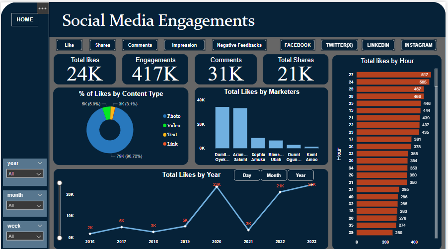
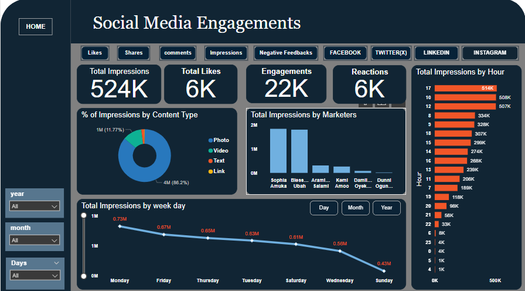
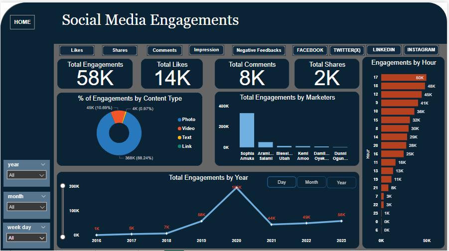
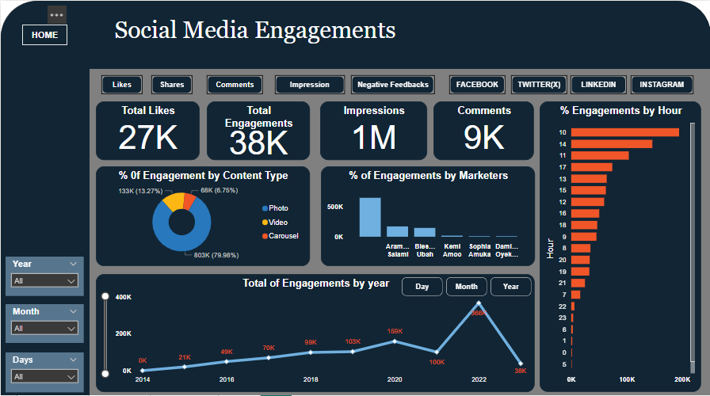

### 📊 Descriptive Analysis Overview

**Social Media Engagement Analysis Project**

This project analyzes social media engagement metrics across four major platforms: Facebook, LinkedIn, Twitter, and Instagram. The analysis provides insights into user behavior, content performance, and platform-specific trends.

Contents:
- Data collection and preprocessing scripts
- Exploratory data analysis and visualization code
- Key findings and recommendations

---

### 🧮 1. Facebook Social Media Engagements

The Dashboard above provides a comprehensive view of how the target variable is distributed across the dataset. This helps in understanding class imbalance, which is critical for designing effective predictive models. As seen, there are charts that shows the trend of engagements amongst marketters, content types, yearly and hourly. This gives a clear insight on  how engagement went down amongst engagers at a particular point in time.

---

### 📈 2. LinkedIn Social Media Engagement

"This project examines LinkedIn engagement metrics, shedding light on professional networking habits and content strategies that resonate with users."
"Unlocking insights into LinkedIn user behavior, this project offers valuable takeaways for professionals and marketers looking to optimize their content."

---

### 🧭 3. Twitter Social Media Engagement

"This project dives into Twitter engagement metrics, revealing patterns and trends in user interactions and content sharing on the platform."
"Analyzing Twitter data to understand what sparks engagement, this project provides insights for brands, marketers, and content creators."

---

### 🧱 4. IG Social Media Engagements

 "This project investigates Instagram engagement metrics, uncovering the secrets to successful content strategies and user interactions on the platform." 
 "Exploring Instagram user behavior and content performance, this project offers actionable insights for brands, influencers, and marketers."

---

## 🔍 Summary

This project analyzes social media engagement metrics across Facebook, LinkedIn, Twitter, and Instagram, providing insights into user behavior, content performance, and platform-specific trends. The analysis offers actionable takeaways for content creators, marketers, and professionals looking to optimize their social media strategies.

Key Highlights:

- In-depth analysis of engagement metrics across four major social media platforms
- Insights into user behavior, content performance, and platform-specific trends
- Actionable recommendations for content creators, marketers, and professionals
  
This research  anlysis is beneficial to
1. Social Media Marketers: Understand what works and what doesn't in their content strategies.
2. Content Creators: Gain insights into audience preferences and engagement drivers.
3. Brand Managers: Optimize their social media presence and engagement strategies.
4. Influencers: Refine their content and engagement approaches to better connect with their audience.
5. Business Owners: Make data-driven decisions to improve their social media marketing efforts.
6. Researchers: Explore social media trends, user behavior, and platform-specific dynamics.

---
